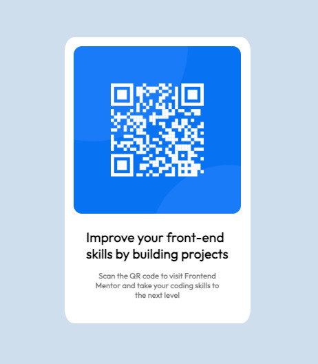

# Frontend Mentor - QR code component solution

This is a solution to the [QR code component challenge on Frontend Mentor](https://www.frontendmentor.io/challenges/qr-code-component-iux_sIO_H). Frontend Mentor challenges help you improve your coding skills by building realistic projects. 

## Table of contents

- [Overview](#overview)
  - [Screenshot](#screenshot)
  - [Links](#links)
- [My process](#my-process)
  - [Built with](#built-with)
  - [What I learned](#what-i-learned)
  - [Continued development](#continued-development)
- [Author](#author)
- [Acknowledgments](#acknowledgments)

## Overview

### Screenshot



### Links

- Solution URL: https://github.com/bootupAbdullah/QR-Code-Project
- Live Site URL: https://bootupabdullah.github.io/QR-Code-Project/

## My process

### Built with

- Semantic HTML5 markup
- CSS custom properties
- Flexbox


### What I learned

I was able to continue building on my understanding of css and got lots mor practice with media queries.

```css
@media (max-width: 800px) {
    .main-container {
        width: 95%; 
    }
}

@media (max-width: 480px) {
    main{
          width: 95%;
          height: 70vh;
          /* border: solid black 2px; */
      
    }

    .main-container {
        width: 85%;
        height: 60vh;
        margin-right: 5px;
    }

    #bold-text-div {
        font-size: 1.4em;
        font-weight: 900;
    }

    #paragraph-text-div {
        font-size: 1em;
        font-weight: 300;
    }
```

### Continued development

I want to try and focus on mobile first development. Teh media queries can be a little daunting because at first the seem counter intuitive - with max width being - within this framework almost like when below the width so that is a little confusing but I am glad I kept going and tried.

### Useful resources


## Author

- Website - Abdullah Durrani (www.linkedin.com/in/abdullah-durrani)
- Frontend Mentor - @bootupAbdullah (https://www.frontendmentor.io/profile/bootupAbdullah)


## Acknowledgments

ChatGPT helped with media queries breakdown

